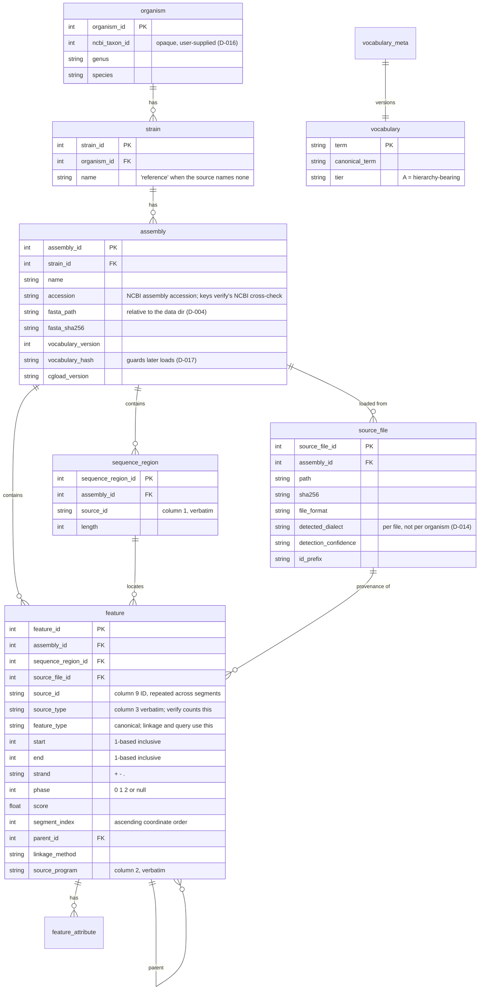

# Schema

Nine tables. Three of them exist because of decisions taken after the original
eight-table design, and each has to be justified in the paper:

| Table | Why it exists |
|---|---|
| `source_file` | D-014: provenance is per input file, because one assembly's annotation may arrive as several files of different origin |
| `vocabulary` | D-017: the type map is versioned data, so extending it is a row rather than a release |
| `vocabulary_meta` | D-017: the version and content hash that every assembly records, so a changed vocabulary cannot silently alter the meaning of rows loaded earlier |

Functional annotation (eggNOG, InterProScan) has **no table yet** — it arrives
at milestone 7 and is deliberately outside the feature-graph engine (D-013).

The definitive statement is `src/cgload/db/schema.py`, which is
written to be read; this page explains the four choices that are not obvious
from it.

## 1. Two type columns, because verification and linkage need different answers

`source_type` is column 3 exactly as it appeared and is never rewritten.
`feature_type` is the canonical term after synonym mapping.

`verify` counts `source_type`. The naive source-side pass and the database
side therefore share no input at all — not the parser, not the profile, not
the type map — which is what makes D-008's independence claim true rather than
aspirational. Normalising for counting would break it: if AUGUSTUS
`transcript` were stored as `mRNA`, the database's mRNA count would include
features the source never called mRNA.

`query` and every linkage rule use `feature_type`. `stats` reports both, since
it is the one command where the two genuinely differ; `--by={source,canonical}`
collapses to one.

For a term absent from the vocabulary, the two columns are equal. Nothing is
rejected; unknown terms are named in the load summary, and
`--strict-vocabulary` turns them into an error.

## 2. One row per segment, one feature per `source_id`

GFF3 represents a discontinuous feature by repeating one ID across its
segments: `ID=cds-XP_012345.1` appears once per CDS segment, which is to say on
essentially every RefSeq gene. Those are stored as N rows sharing a
`source_id`, with `segment_index` ascending in **coordinate** order and strand
held separately — not file order, which some pipelines emit 3'→5' on the minus
strand.

Two counts follow, and conflating them is the most likely way to break the
headline feature:

| Question | Query |
|---|---|
| How many features? (primary check) | `COUNT(DISTINCT source_id)` grouped by `source_type` |
| How many segments? (secondary check) | `COUNT(*)` |

Uniqueness is `(sequence_region_id, source_id, start, end)` — per region, not
per assembly, because IDs are only required to be unique within a region.

## 3. Indexes are portable by construction

`(assembly_id, source_type)` for `verify`, `(assembly_id, feature_type)` for
`query`, `(sequence_region_id, start, end)` for region overlap. The last one is
a plain B-tree: SQLite's RTREE is a compile-time-optional module with no MySQL
or PostgreSQL equivalent, and using it would quietly void D-002's claim that
all three backends run through one code path. A test asserts no virtual table
exists.

## 4. The vocabulary is versioned data, not free-form data

Making the type map a table means extending it is a row rather than a release.
That is also its danger: a row insert changes what `feature_type` means, and
rows already stored are not re-mapped. So `vocabulary_meta` carries a version
and a content hash — over the terms, the parent-child rules and the linkage
method vocabulary, since any of the three changes linkage semantics — and every
assembly records the hash it was loaded under. `load`, `verify`, `query` and
`export` call `assert_vocabulary_current()` first and refuse a mismatch,
directing the user to `cgload remap`.

## Conventions

- Coordinates are 1-based inclusive on the forward strand, the GFF3
  convention. Biopython's 0-based half-open GenBank locations are converted in
  the parser; nothing downstream of the parser sees the other convention.
- `fasta_path` is relative to the data directory. An absolute path makes the
  database non-portable, which defeats the point of D-002.
- Foreign keys are enforced on SQLite via `PRAGMA foreign_keys=ON`, set on
  connect. Without it every `ForeignKey` here would be decorative.
